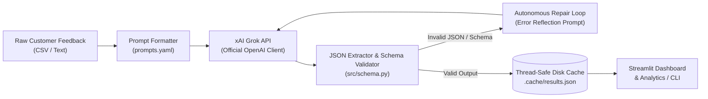

# Customer Feedback Analyzer (LLM-powered NLP)

An enterprise-grade, LLM-powered natural language processing system that transforms unstructured customer feedback into structured, actionable business intelligence using the xAI Grok API (via OpenAI-compatible endpoint).

For each feedback submission, the pipeline extracts:
- **Sentiment**: Classification (`positive`, `neutral`, `negative`, `mixed`) with a normalized score from `-1.0` to `+1.0`.
- **Category**: Domain classification (`billing`, `delivery`, `product_quality`, `customer_support`, `technical_issue`, `feature_request`, `other`).
- **Urgency**: Prioritization level (`low`, `medium`, `high`) identifying safety hazards, financial losses, or churn threats.
- **Named Entities**: Entity extraction for `PRODUCT`, `ORG`, `PERSON`, `LOCATION`, `DATE`, `MONEY`, and `ORDER_ID`.
- **Key Issues**: Top issue noun phrases (max 3).
- **Summary**: Concise one-sentence overview (under 25 words).
- **Suggested Reply**: Empathetic, policy-safe auto-response tailored to the specific complaint or feedback.

---

## 🏗️ Architecture



---

## 📁 Folder Structure

```
nlp-feedback-analyzer/
├── .env.example              # Template for API keys (XAI_API_KEY)
├── .gitignore                # Git ignore rules for keys, cache, and venv
├── app.py                    # Multi-tab Streamlit dashboard with Demo & Live modes
├── config.yaml               # Model configuration, backoff, workers, cache, paths
├── main.py                   # CLI entry point (analyze, batch, evaluate)
├── prompts.yaml              # Versioned system, user few-shot, and repair prompts
├── requirements.txt          # Python dependencies
├── data/
│   ├── demo_results.json     # Validated precomputed results for offline demo mode
│   ├── labeled_eval.csv      # 24 labeled evaluation samples (sarcasm, mixed, all categories)
│   └── sample_feedback.csv   # 10 realistic customer feedback samples
├── src/
│   ├── __init__.py
│   ├── analyzer.py           # Core FeedbackAnalyzer pipeline and ResultCache
│   ├── config.py             # Config & prompt YAML loaders
│   ├── evaluate.py           # Benchmark evaluation (per-field accuracy & score MAE)
│   ├── llm_client.py         # OpenAI-compatible xAI Grok wrapper with exponential backoff
│   ├── report.py             # Aggregate statistics and markdown report generator
│   └── schema.py             # Schema rules, enums, clamping, and word limits
└── tests/
    ├── conftest.py           # Shared fixtures, fake client, and OpenAI exception mocks
    ├── test_analyzer.py      # Tests for repair loop, cache, order preservation, progress
    ├── test_app.py           # Streamlit AppTest smoke test in demo mode
    ├── test_cli.py           # CLI tests for analyze, batch, and evaluate subcommands
    ├── test_evaluate.py      # Tests for accuracy math, MAE, errors, and markdown report
    ├── test_llm_client.py    # Tests for retries on 429/5xx, no retry on 4xx/auth, backoff
    ├── test_parsing.py       # Tests for JSON extraction (fences, prose, malformed)
    └── test_schema.py        # Tests for schema validation, bad labels, score clamping
```

---

## ⚡ Setup & Installation

### 1. Prerequisites
- Python 3.10+
- xAI API key (optional for demo mode and tests; required for live model calls)

### 2. Environment Setup
```bash
# Navigate to the project directory
cd code/nlp-feedback-analyzer

# Create and activate virtual environment
python -m venv venv
# On Windows:
venv\Scripts\activate
# On Linux/macOS:
source venv/bin/activate

# Install dependencies
pip install -r requirements.txt
```

### 3. API Key Configuration
Copy the template and insert your xAI API key:
```bash
cp .env.example .env
```
Inside `.env`:
```ini
XAI_API_KEY=xai-your-api-key-here
```
> **Security Reminder**: Never commit `.env` or log API keys to version control. The repository `.gitignore` automatically excludes `.env`.

### 4. Model Selection in `config.yaml`
Specify your preferred model in `config.yaml`:
```yaml
llm:
  provider: xai
  base_url: https://api.x.ai/v1
  model: grok-beta   # or grok-2-latest
```

---

## 🖥️ Usage

### Interactive Streamlit Dashboard
Launch the web interface:
```bash
streamlit run app.py
```
The dashboard features 5 functional tabs:
1. **📊 Dashboard**: KPI metric cards (Total items, Average Sentiment Score, Negative Share, High Urgency Count), interactive Altair distribution charts (sentiment, urgency, category, top issues), filters for sentiment/category/urgency, high-urgency triage table, and CSV export.
2. **🔍 Live Analyzer**: Single-text inspection with instant categorization, entity tagging, and suggested reply generation.
3. **📁 Batch Run**: Upload any CSV with feedback text, run multithreaded analysis with a real-time progress bar, and load results into the dashboard.
4. **📈 Evaluation**: Run benchmark evaluations on `data/labeled_eval.csv` and view accuracy metrics and mismatch tables.
5. **⚙️ How It Works**: Visual pipeline DAG, architecture breakdown, and live viewers for `prompts.yaml` and `config.yaml`.

#### Demo Mode
The application runs out of the box in **DEMO MODE** without an API key by loading precomputed, verified results from `data/demo_results.json`. A clear banner informs the user that demo mode is active. Live tabs gracefully display a friendly warning if credentials are not configured.

---

### Command Line Interface (CLI)

#### 1. Single Feedback Analysis
```bash
python main.py analyze "The app crashes every time I open settings on my Pixel 8."
```

#### 2. Batch Processing CSV
```bash
python main.py batch --input data/sample_feedback.csv
```
Outputs are automatically written to `output/results.json` and `output/report.md`.

#### 3. Benchmark Evaluation
```bash
python main.py evaluate --input data/labeled_eval.csv
```

---

## 🧪 Testing

All unit tests run completely **offline** without needing an API key, using mock clients and synthetic OpenAI exceptions:
```bash
pytest -v
```
To run quietly:
```bash
pytest -q
```

---

## 🎯 Prompt Engineering & Design Choices

1. **Strict System Prompt**: Constrains the model to act as an objective customer experience analyst, forbidding conversational filler, markdown formatting outside of JSON, or unsupported claims in suggested replies.
2. **Few-Shot In-Context Examples**: Incorporates realistic few-shot examples demonstrating subtle classification edges (e.g., distinguishing high urgency churn threats from low urgency feature requests).
3. **JSON Schema Enforcement**: Detailed schema definition in the prompt paired with programmatic schema validation in `src/schema.py`.
4. **Self-Healing Repair Loop**: If an LLM response contains invalid JSON or violates schema constraints (e.g., unknown label or missing field), the `repair_template` feeds the exact validation error back to the model for self-correction before failing.
5. **Deterministic Temperature**: Set to `temperature: 0.0` to minimize hallucination and enforce reproducible label selection.
6. **Prompt Versioning**: `prompts.yaml` includes a `version: "1.0"` field that forms part of the SHA-256 cache key. When prompts are modified, old cached entries are automatically invalidated.

---

## 🛡️ Error Handling, Retry Policy & Caching

### Robust Retry Strategy
- **Retryable Errors**: Automatically retries on `openai.RateLimitError` (HTTP 429), `openai.APIConnectionError`, `openai.APITimeoutError`, and 5xx `openai.APIStatusError`.
- **Non-Retryable Errors**: Immediately halts and raises on `openai.AuthenticationError` (HTTP 401) and client-side 4xx errors (`APIStatusError`).
- **Exponential Backoff**: Applies exponential backoff delay calculated as $\text{delay} = \text{backoff\_base\_seconds} \times 2^{\text{attempt}}$.
- **Safe Batch Execution**: In `analyze_batch`, individual row errors are captured in the row record (`{"error": ...}`) rather than aborting the entire batch.

### Content-Addressable Disk Caching
- Cache key: `SHA-256(model + prompt_version + input_text)`.
- Eliminates duplicate API charges and enables instant responses on repeated feedback.
- Thread-safe disk persistence flushed after batch executions.

---

## 📊 Evaluation Methodology & Limitations

### Evaluation Metrics
- **Field Accuracy**: Exact match accuracy on `sentiment`, `category`, and `urgency`.
- **Overall Accuracy**: Strictest metric requiring all three fields to match simultaneously.
- **Sentiment Score MAE**: Mean Absolute Error comparing predicted sentiment scores with benchmark baseline scores.
- **Mismatch Tracking**: Every discrepancy is logged with the original text, expected label, and predicted label.

### Benchmark Dataset (`data/labeled_eval.csv`)
24 curated samples covering:
- All 7 categories: `billing`, `delivery`, `product_quality`, `customer_support`, `technical_issue`, `feature_request`, `other`.
- All 4 sentiments: `positive`, `neutral`, `negative`, `mixed`.
- All 3 urgency tiers: `low`, `medium`, `high`.
- Edge cases including at least 4 sarcastic feedbacks and 4 mixed sentiment submissions.

### Limitations
- Sarcasm detection heavily relies on prompt few-shots and model capability.
- Multi-lingual feedback currently requires English or relies on the LLM's intrinsic translation.
- High-volume production deployments would benefit from fine-tuning or dedicated embedding-based retrieval for suggested replies.

---

## 🔒 Security Best Practices
- **No Hardcoded Credentials**: API keys are accessed exclusively via `os.getenv("XAI_API_KEY")`.
- **Git Hygiene**: `.env`, `.cache/`, `output/`, and `.pytest_cache/` are ignored in `.gitignore`.
- **Input Truncation**: Truncates text inputs to `max_input_chars: 2000` to prevent token exhaustion and prompt injection abuse.
- **Safe Response Generation**: Suggested replies are prompted to never guarantee refunds or promise actions without authorization.
